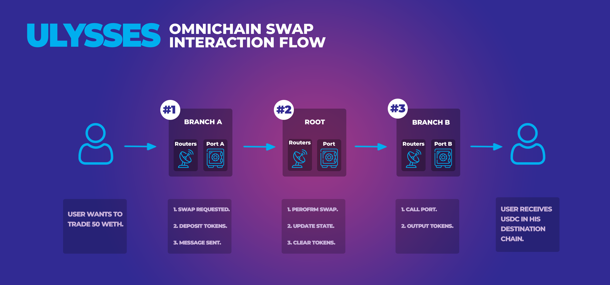

[//]: # (TODO: Add some links / references to Routers docs pages)

In our platform, **Bridge Agents** facilitate seamless communication between two chains, functioning as essential intermediaries. They not only transmit user requests but also manage the system's responses, ensuring smooth connections.

## Overview

Bridge Agents come in two types:

### 1. **Branch Bridge Agents**

Branch Bridge Agents mediate interactions with a [Branch Router](./04-routers.md). They track user [Deposits](../glossary#deposits), communicate with the local Branch Port (_learn more about Ports_ [_here_](./01-ports.md)) for asset deposit/withdrawal, and engage with virtualized token contracts.

### 2. **Root Bridge Agents**

Root Bridge Agents, located in the Root Chain, liaise with all connected Branch Chains and their respective Branch Bridge Agents. Like their counterparts, Root Bridge Agents also interact with Ports and virtualized assets (_read more about Virtualized Liquidity_ [_here_](./02-virtual-liquidity.md)), but instead, monitor pending user [Settlements](../glossary#settlements). Each Root Bridge Agent connects to a [Root Router](./04-routers.md), enabling seamless integration with other dApps in the Root Chain.

## Swap Interaction Flow

Let's examine a swap example to understand user interaction with Branch and Root Routers.

1. **User Request:** The user submits a swap request to the Branch Bridge Agent, providing required parameters.

2. **Deposit Assets:** The originating Branch Bridge Agent locks the user's necessary balance and logs the deposit. The essential data is then relayed to the corresponding Root Bridge Agent via the LayerZero messaging layer.

3. **Receive Request:** The Root Bridge Agent authenticates and validates the request and deposit data received from the Branch Bridge Agent. If valid, the request is forwarded to the corresponding Root Router.

4. **Perform Swap:** The Root Router executes the user swap and instructs the Root Bridge Agent to transfer output tokens to the desired destination chain.

5. **Create Settlement and Send Response:** The Root Bridge Agent generates a settlement for the user token output and dispatches a token clearance request to the exit chain's Branch Bridge Agent.

6. **Receive Request and Clear Tokens:** Upon receiving the Root Bridge Agent's communication, the destination Branch Bridge Agent requests token clearance for user withdrawal from the local Port.

When using our platform, requests betweent two chains will always be flow through a Bridge Agent. This agent acts in the same way that a neural pathway works in a body - relaying information back and forth between its different organs. These Bridge Agents not only receive and broadcast user requests but also take on the responsibility for the system's responses. By acting as an intermediary between the user and the system, it ensures that the connection is made without any issues.

