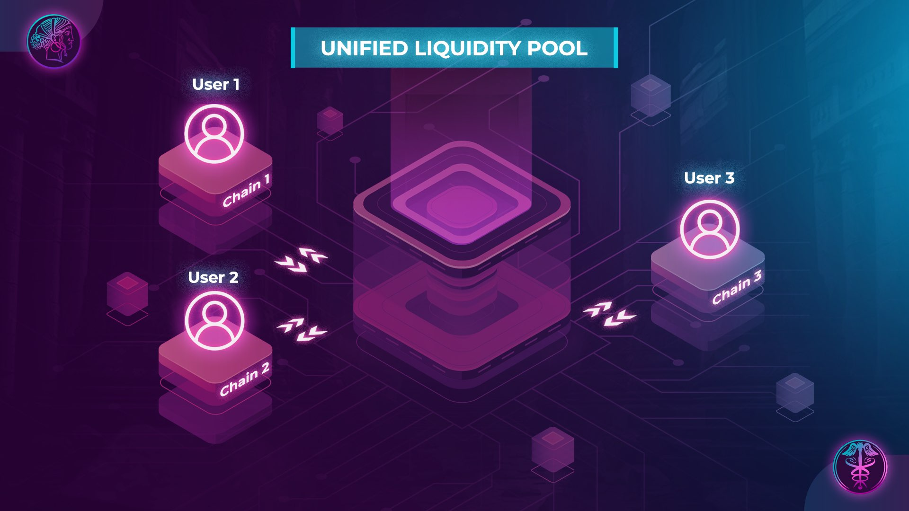

[//]: # (TODO: Add visuals examples)

Ulysses Unified Tokens represent a breakthrough in accessing liquidity across multiple blockchains. These tokens allow users to engage with a liquidity pool from diverse chains with ease and flexibility. This documentation provides an in-depth understanding of Ulysses Unified Tokens, their design, benefits, and potential applications.

Ulysses Unified Tokens enable users to tap into liquidity pools from multiple chains through a singular, unified token. These tokens act as wrappers for Arbitrum's [Balancer's Composable Composable Stable Pools](https://docs.balancer.fi/concepts/pools/composable-stable.html), allowing their seamless operation in any decentralized application (dApp) across various networks.

Guaranteeing effortless integrations and optimal liquidity management, every Ulysses LP (Liquidity Provider) token's total supply precisely mirrors the total withdrawable assets when the pool is balanced.

## Compatibility and Design

Ulysses Unified Tokens have been designed to allow the addition or removal of underlying assets at a consistent ratio. This offers unparalleled flexibility and control. The 1:1 ratio between the LP and underlying assets addresses complex challenges, ensuring streamlined asset value tracking for users and protocols.

The primary execution and liquidity environment for Ulysses is based in Arbitrum. This design choice creates a balance in composability both within and outside of Arbitrum. While protocols inside Arbitrum enjoy no cross-chain overheads, those operating outside will face some. In essence, while transactions within Arbitrum guarantee finality, those originating from other chains might not have the same assurance. However, users can facilitate trades between various Ulysses LPs from different chains within the same environment, bypassing cross-chain calls and making arbitrage more cost-effective.

## Protocol Fees

Deposits in the form of Balancer Pool Tokens (BPT) are accepted by [Composable Stable Pool Wrappers](https://github.com/Maia-DAO/ComposableStablePoolWrapper). This mechanism ensures the invariant to BPT supply ratio remains stable by accumulating swap fees.

Hermes Governance, a core decision-making body within Ulysses, determines the distribution of these fees to their designated gauges. If a token lacks a gauge, Hermes Governance takes the lead in deciding the utilization of the accumulated fees.

## Use Cases for Ulysses Unified Tokens

### Trading and Liquidity Provision

Users can harness the power of Ulysses Unified Tokens for both trading and offering liquidity to other pools. For example, you can trade your Ulysses Unified Token for another asset on the Binance Smart Chain using Uniswap V3. Additionally, these tokens can be used to introduce liquidity to an Arbitrum pool directly from Optimism or any other supported chain.

### Building Blocks for Other Applications

Ulysses Unified Tokens are not just for trading. They can underpin other applications too. A lending platform could accept them as collateral, giving users the flexibility to borrow against their assets spread over multiple chains. A stablecoin provider could use the Ulysses Unified Tokens as a foundation to craft a multi-chain stablecoin that's pegged to the value of several underlying assets.

## Summary and Key Takeaways

Ulysses Unified Tokens are a pioneering token solution, crafted to give users single-point access to liquidity pools spread over multiple chains. They bring flexibility, user control, and ease in asset value tracking. These tokens find applications in trading, liquidity provisioning, and as core components for other applications like lending platforms or stablecoin issuance. They represent the future of digital assets, aiming to increase capital efficiency by reducing fragmented liquidity across chains.
