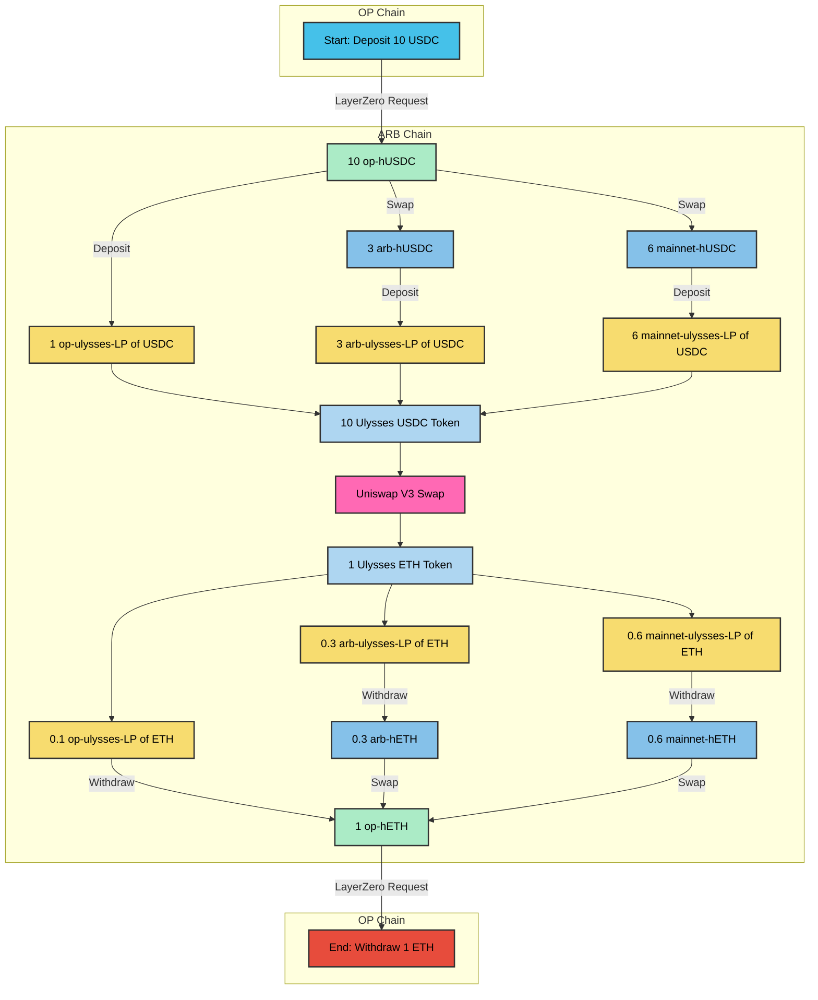
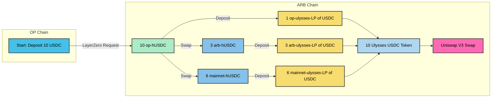
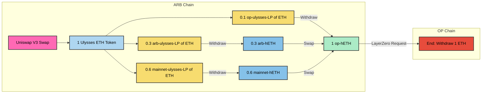

import Tabs from '@theme/Tabs';
import TabItem from '@theme/TabItem';

[//]: # (TODO: Add visuals examples)

Ulysses Unified Tokens enables users to access liquidity pools from multiple chains using a single, unified token. These tokens serve as wrappers for two or more Ulysses Liquidity Pools (ULPs) from various chains, making them available and functional in any decentralized application (dApp) on any network.

## Compatibility and Design

Ulysses Unified Tokens are compatible with any number of ERC-20 tokens and are designed primarily for use with Ulysses LPs. These tokens enable users to add or remove underlying assets at a fixed ratio, offering flexibility and control. Plus, the 1:1 ratio between the LP and underlying assets simplifies asset value tracking.

## Use Cases for Ulysses Unified Tokens

### Trading and Liquidity Provision

Ulysses Unified Tokens can be utilized for trading and providing liquidity to other pools. For instance, users can trade their Ulysses Unified Token for another asset on the Binance Smart Chain using Uniswap V3. They can also add liquidity to an Arbitrum pool from Optimism with their Ulysses Unified Token.

### Building Blocks for Other Applications

Ulysses Unified Tokens can serve as a foundation for other applications. A lending platform might use them as collateral, allowing users to borrow against their assets across multiple chains. Similarly, a stablecoin issuer could leverage Ulysses Unified Tokens to create a omnichain stablecoin pegged to the value of multiple underlying assets.

## Summary and Key Takeaways

Ulysses Unified Tokens are an innovative token type that enables users to access liquidity pools from multiple chains through a single, unified token. They offer flexibility, control, and simplified asset value tracking for users. These tokens can be used for trading, adding liquidity, and as building blocks for other applications, such as lending and stablecoin issuance. By allowing users to manage digital assets across various chains, Ulysses Unified Tokens help reduce fragmented liquidity and increase capital efficiency.

## Interaction Flow of a Swap Using Unified Liquidity Tokens
In this example, Ulysses USDC Token and Ulysses ETH Token have the same weights: (60% mainnet, 30% arb, 10% OP) 

| Step | Action | Deposit | Return | Platform | Chain |
| --- | --- | --- | --- | --- | --- |
| 1 | Deposit and Bridge | 10 USDC |  | Ulysses Branch Port | OP |
| 2 | Send LayerZero Request |  |  |  |  |
| 3 | Receive |  | 10 op-hUSDC | Ulysses Root Port | ARB |
| 4 | Deposit | 1 op-hUSDC | 1 op-ulysses-LP of USDC | Ulysses AMM | ARB |
| 5 | Swap | 3 op-hUSDC | 3 arb-hUSDC | Ulysses AMM | ARB |
| 6 | Deposit | 3 arb-hUSDC | 3 arb-ulysses-LP of USDC | Ulysses AMM | ARB |
| 7 | Swap | 6 op-hUSDC | 6 mainnet-hUSDC | Ulysses AMM | ARB |
| 8 | Deposit | 6 mainnet-hUSDC | 6 mainnet-ulysses-LP of USDC | Ulysses AMM | ARB |
| 9 | Deposit | 1 op-ulysses-LP of USDC  3 arb-ulysses-LP of USDC  6 mainnet-ulysses-LP of USDC | 10 Ulysses USDC Token | Ulysses Token | ARB |
| 10 | Swap | 10 Ulysses USDC Token | 1 Ulysses ETH Token | Uniswap V3 | ARB |
| 11 | Withdraw | 1 Ulysses ETH Token | 0.1 op-ulysses-LP of ETH  0.3 arb-ulysses-LP of ETH  0.6 mainnet-ulysses-LP of ETH | Ulysses Token | ARB |
| 12 | Withdraw | 0.1 op-ulysses-LP of ETH | 0.1 op-hETH | Ulysses AMM | ARB |
| 14 | Withdraw | 0.3 arb-ulysses-LP of ETH | 0.3 arb-hETH | Ulysses AMM | ARB |
| 15 | Swap | 0.3 arb-hETH | 0.3 op-hETH | Ulysses AMM | ARB |
| 16 | Withdraw | 0.6 mainnet-ulysses-LP of ETH | 0.6 mainnet-hETH | Ulysses AMM | ARB |
| 17 | Swap | 0.6 mainnet-hETH | 0.6 op-hETH | Ulysses AMM | ARB |
| 18 | Bridge and Withdraw | 1 op-hETH |  | Ulysses Root Port | ARB |
| 19 | Send LayerZero Request |  |  |  |  |
| 20 | Withdraw |  | 1 ETH | Ulysses Branch Port | OP |

This table represents a series of actions performed on the Ulysses platform, which involves deposits, swaps, and withdrawals across different chains. The process begins with depositing USDC in the Ulysses Branch Port on the OP chain, and ends with the withdrawal of ETH from the same port. The steps are as follows:

1. Deposit 10 USDC in the Ulysses Branch Port on the OP chain.
2. Send an LayerZero request.
3. Receive 10 op-hUSDC in the Ulysses Root Port on the Arbitrum (ARB) chain.
4. Deposit 1 op-hUSDC in the Ulysses AMM on the ARB chain and receive 1 op-ulysses-LP of USDC.
5. Swap 3 op-hUSDC for 3 arb-hUSDC using the Ulysses AMM on the ARB chain.
6. Deposit 3 arb-hUSDC in the Ulysses AMM on the ARB chain and receive 3 arb-ulysses-LP of USDC.
7. Swap 6 op-hUSDC for 6 mainnet-hUSDC using the Ulysses AMM on the ARB chain.
8. Deposit 6 mainnet-hUSDC in the Ulysses AMM on the ARB chain and receive 6 mainnet-ulysses-LP of USDC.
9. Deposit a combination of LP tokens (1 op, 3 arb, and 6 mainnet) in the Ulysses Token on the ARB chain and receive 10 Ulysses USDC Tokens.
10. Swap 10 Ulysses USDC Tokens for 1 Ulysses ETH Token using Uniswap V3 on the ARB chain.
11. Withdraw LP tokens of ETH (0.1 op, 0.3 arb, and 0.6 mainnet) from the Ulysses Token on the ARB chain using 1 Ulysses ETH Token.
12. Withdraw 0.1 op-hETH from the Ulysses AMM on the ARB chain using 0.1 op-ulysses-LP of ETH.
13. Withdraw 0.3 arb-hETH from the Ulysses AMM on the ARB chain using 0.3 arb-ulysses-LP of ETH.
14. Swap 0.3 arb-hETH for 0.3 op-hETH using the Ulysses AMM on the ARB chain.
15. Withdraw 0.6 mainnet-hETH from the Ulysses AMM on the ARB chain using 0.6 mainnet-ulysses-LP of ETH.
16. Swap 0.6 mainnet-hETH for 0.6 op-hETH using the Ulysses AMM on the ARB chain.
17. Bridge and withdraw 1 op-hETH using the Ulysses Root Port on the ARB chain.
18. Send an LayerZero request.
19. Withdraw 1 ETH from the Ulysses Branch Port on the OP chain.

### FlowChart

<Tabs>
  <TabItem value="TB" label="Top to Bottom" default>

  </TabItem>
  <TabItem value="LR" label="Left to Right">

  </TabItem>
</Tabs>
